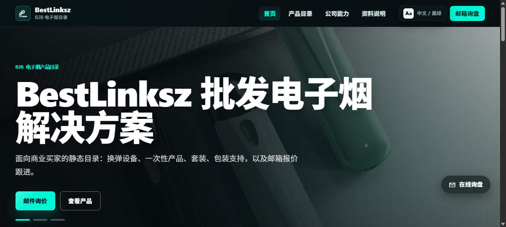
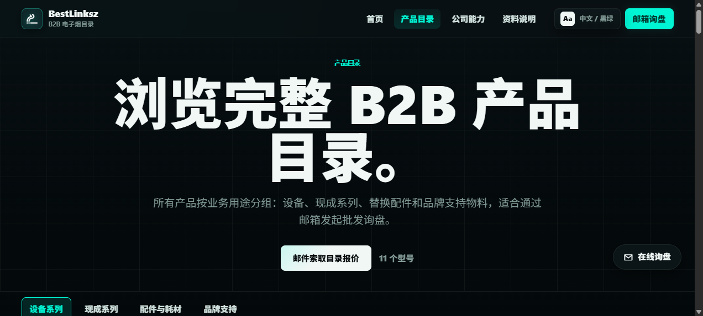
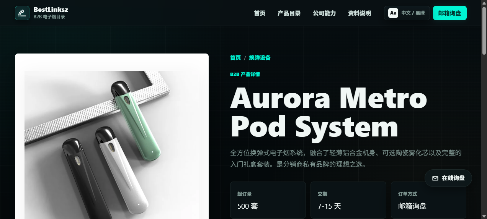
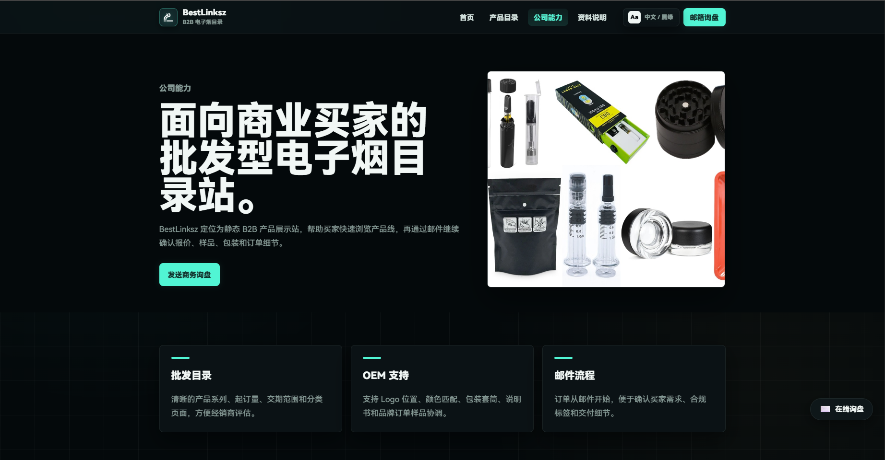

# BestLinksz — B2B Vape Wholesale Catalogue

A static product showcase site for wholesale vape buyers — no cart, payment, or inventory. Built with Vue 3 + Vite, managed via Decap CMS.

[中文说明](./README.zh-CN.md) | **Live site:** [bestlinksz.com](https://www.bestlinksz.com/)

## Screenshots

| Home | Catalogue |
|---|---|
|  |  |

| Product Detail | Company |
|---|---|
|  |  |

## Features

- Multi-level product catalogue with category navigation
- Bilingual (EN / 中文) with automatic system language detection
- Dark / Light / System theme support
- Email-based inquiry flow (Web3Forms or mailto fallback)
- Decap CMS admin panel for zero-code content editing
- SEO-ready: dynamic meta, Open Graph, JSON-LD, sitemap, robots.txt
- Responsive: desktop and mobile layouts
- GitHub Actions auto WebP conversion for uploaded images

## Tech Stack

| Layer | Choice |
|---|---|
| Framework | Vue 3 (Composition API) |
| Build | Vite |
| Styling | Vanilla CSS (custom properties, no UI library) |
| CMS | Decap CMS (git-gateway) |
| Hosting | Netlify (auto-deploy from `main`) |
| Image pipeline | GitHub Actions + Sharp (PNG/JPG → WebP) |

## Quick Start

```sh
npm install
npm run dev        # http://localhost:5173
npm run build      # output → dist/
npm run preview    # preview production build
```

## Project Structure

```
src/
  views/          # Page components (Home, Catalog, Detail, About, Resources)
  components/     # Shared components (InquiryWidget, etc.)
  composables/    # useSeo, useTheme, etc.
  store/          # Reactive data store (products, categories, translations)
  data/
    products/     # One JSON file per product (1.json, 2.json, …)
    categories.js # Category groups and hierarchy
    settings.json # Site-wide settings (email, hero slides, service points)
    translations.json  # All UI text strings (en/zh, flat keys)
  assets/         # Global CSS
public/
  电子烟/          # Product and placeholder images (WebP + SVG)
  admin/          # Decap CMS config and custom admin UI
```

## Content Editing

### Via CMS Admin (recommended for non-developers)

Visit `/admin/` on the deployed site (or `localhost:5173/admin/` locally). Login through Netlify Identity.

The admin panel provides guided editing for:
- **Settings** — inquiry email, Web3Forms key, hero slides, service points
- **Categories** — category groups, hierarchy, hero images
- **Products** — name, images, specs, MOQ, lead time, sort order
- **Translations** — all ~150 UI text strings in EN and ZH

### Via Code (for developers)

Product data lives in `src/data/products/*.json`. Each file is one product:

```json
{
  "id": 1,
  "name": "Aurora Metro Pod System",
  "category": "pod-systems",
  "image": "/电子烟/Product1_1.webp",
  "images": ["/电子烟/Product1_1.webp", "/电子烟/Product1_2.webp"],
  "highlights": ["Ceramic coil technology", "Type-C charging"],
  "specs": [{ "label": "Battery", "value": "500 mAh" }],
  "moq": "1000 pcs",
  "leadTime": "10-18 days"
}
```

UI translations are in `src/data/translations.json` (flat keys like `"nav.home"`, `"home.title"`).

## Image Rules

- All product images go in `public/电子烟/` and must be **WebP** (except `placeholders/*.svg`)
- Reference paths without `public/`: `'/电子烟/Product1_1.webp'`
- Uploaded PNG/JPG images are auto-converted to WebP by GitHub Actions on push

### Image Guidelines

- Hero images: 1600-2200px wide, < 500KB each
- Product images: 900-1400px wide, < 300KB each
- Category hero images must be clean close-ups without text or spec charts

## Language Switching

The site defaults to English. A toggle at the top switches between EN / 中文. The choice is saved in `localStorage`.

UI text strings live in `src/data/translations.json` (flat keys like `"nav.home"`, `"home.title"`). Product and category Chinese content is in each data object's `xxxZh` fields.

## SEO

- `index.html` — title, description, keywords, OG/Twitter meta, initial JSON-LD
- `src/App.vue` — per-page dynamic title, description, canonical, OG, structured data
- `public/robots.txt` — allows search engine crawling
- `public/sitemap.xml` — lists home, category, and product pages

Default domain is `https://www.bestlinksz.com/`. When changing domains, update `index.html`, `src/App.vue`, `robots.txt`, and `sitemap.xml`.

## CMS Local Development

```sh
# Terminal 1: start the local CMS proxy
npx decap-server

# Terminal 2: start the dev server
npm run dev
```

Then open `http://localhost:5173/admin/` and click the green **Login** button (no password needed locally).

## Deployment

The site auto-deploys to Netlify from the `main` branch. Push to deploy:

```sh
git push origin main
```

Netlify handles SPA routing (all paths → `index.html`).

### Netlify Identity Setup (for CMS login)

1. **Enable Identity** — Site configuration → Identity → Enable
2. **Set registration to Invite only** — prevents unwanted signups
3. **Enable Git Gateway** — Identity → Services → Git Gateway → Enable
4. **Invite users** — Identity tab → Invite users → enter email

Invited users log in at `https://your-domain/admin/`.

## License

Private — all rights reserved. Source code is made public for transparency and collaboration; it is not licensed for redistribution or commercial use without written permission.